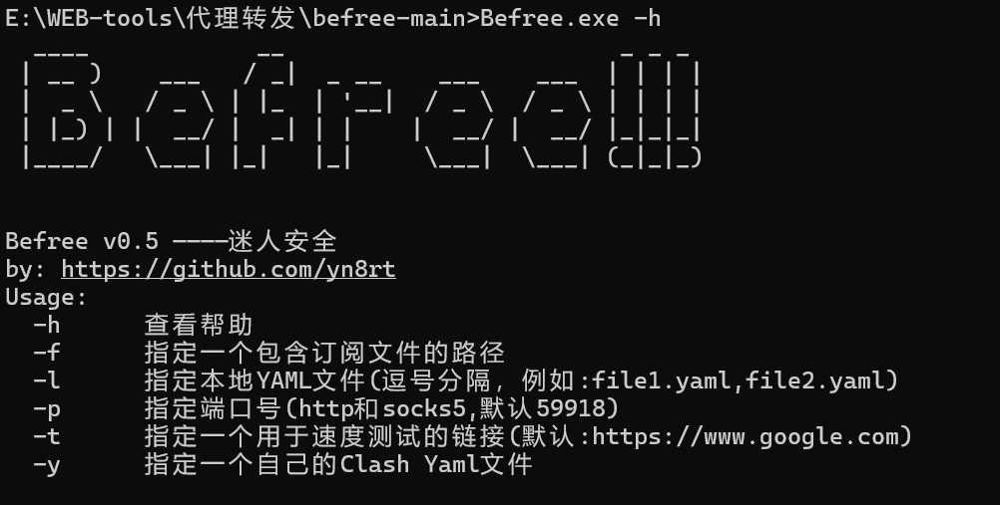

# Befree

一款通过轮询各类订阅中节点的代理池工具

看了v2rayN、sstap等工具之后，发现很多类似的工具基本都是套了个壳，最后还是调用clash、xray等代理工具。

于是为了操作方便以及代理池的需求，有了这款工具。通过解析订阅中各个节点，重新生成clash配置文件，调用clash，进行节点轮询，达到代理池的效果。

本来打算调用clash这部分也重新写一下，后来发现很多协议、很多加解密类型，太繁琐，造轮子有点麻烦，于是最后决定还是直接调用clash。

release中的文件包含了一个mihomo，如果怕存在后门，可以直接下载源码修改befree.csproj以及clashrunner.cs中的mihomo文件路径至自己的mihomo。

## 更新记录

v0.5版本

- 替换内部的clash内核，更改为最新的mihomo
- 支持hysteria2协议

v0.4版本

* 修复了vmess节点端口解析问题。
* 修复了各个节点名为空导致无法使用的问题。
* 修复了部分节点解析逻辑问题。
* 添加了节点解析错误回显日志的功能。
* 修复了clash订阅的识别功能，导入clash订阅不再报错了，暂时没用而已。可自行修改clash的yaml文件，通过-y 直接执行即可。
* 修复了部分节点base64编码的问题。
* 修改了默认监听端口。

v0.3版本

* 修复了lssues中提到的0.2版本的url编码问题。
* 添加了指定yaml文件的参数，可通过-y自定义yaml配置文件。

v0.2版本

* 解决了利用时经常会轮询到不可用的节点，导致代理效果不佳，部分请求出错的问题。
* 通过添加-t参数指定测速的url链接。程序运行后会进行测速，可以稍等一会，完成后每次请求都会通过有效节点进行访问。
* 修复了lssues中因trojan节点解析错误导致程序报错的问题。
* 程序结束后，不用再手动关闭clash进行，将会跟随程序一起关闭。
* 代理结果实时显示befree命令行。
* linux版问题同步修复完成。

## 编码环境

.net8


## 利用方法

```
  -h      查看帮助
  -f      指定一个包含订阅文件的路径
  -l      指定本地YAML文件(逗号分隔，例如:file1.yaml,file2.yaml)
  -p      指定端口号(http和socks5,默认59918)
  -t      指定一个用于速度测试的链接(默认:https://www.google.com)
  -y      指定一个自己的Clash Yaml文件
```


## 利用效果

#### 运行



#### 指定订阅文件，指定监听端口 查询节点


#### 目录扫描

调用dirsx进行扫描效果


#### 指定自己的配置文件


## 当前支持协议

| 协议类型  | 是否支持               |
| --------- | ---------------------- |
| vmess     | 支持√                  |
| trojan    | 支持√                  |
| ss        | 支持√                  |
| ssr       | 解析存在问题，下次更新 |
| hysteria2 | 支持✅                  |

## 致谢

作者原地址：
https://github.com/zidanfanshao/befree
